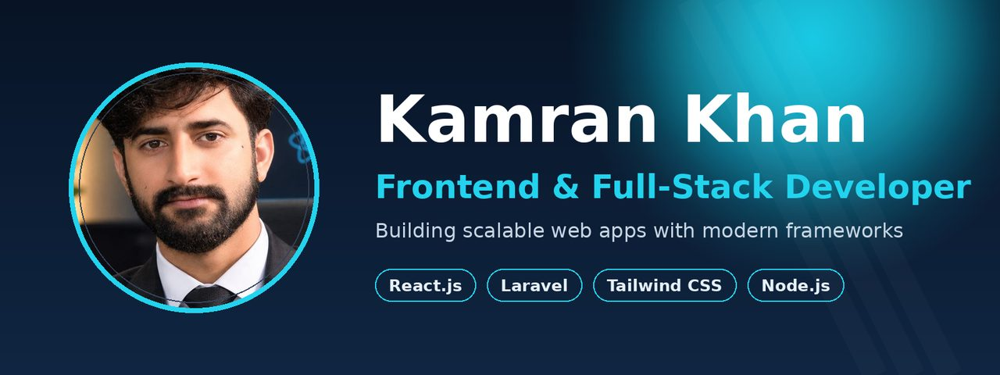

  

<h1 align="center">Kamran Khan — Full-Stack Developer (React.js & Laravel)</h1>
<h3 align="center">Building scalable web apps with modern frameworks · Lahore, Pakistan</h3>

  
  
  
  
  
  
  
  

  

---

### 🚀 About Me

I'm **Kamran Khan**, a **Full-Stack Developer** specializing in **React.js** and **Laravel**. I turn ideas into clean, scalable, user-friendly web applications — from responsive frontends to robust backends and REST APIs.

- 🔭 Currently building with **React.js, TypeScript & Laravel**
- 🌱 Deepening my expertise in TypeScript and full-stack architecture
- 💼 **Open to freelance projects** — [let's work together](https://www.upwork.com/freelancers/~01cb7445d5ef7df0ae?mp_source=share)
- 📍 Based in **Lahore, Pakistan** · collaborating with clients worldwide

---

### 🛠️ Tech Stack

**Frontend**

**Backend**

**Tools**

---

### 🏆 Featured Projects

| Project | Description | Stack |
|---------|-------------|-------|
| [KickZone](https://github.com/kamran1272/kickzone) | Sports management system — role-based platform for managing teams, players, and events *(Final Year Project)* | Laravel |
| [Vendora](https://github.com/kamran1272/Vendora_ecom) | Full-featured e-commerce application with product catalog, cart, and checkout | TypeScript |
| [Surfside](https://github.com/kamran1272/Surfside) | E-commerce website with product catalog, cart, and checkout flow | Laravel |
| [Portfolio](https://github.com/kamran1272/portfolio) | Personal portfolio website | JavaScript |
| [Restaurant Website](https://github.com/kamran1272/restaurant-website) | Modern restaurant website | JavaScript |
| [My E-Commerce App](https://github.com/kamran1272/my-ecommerce-app) | E-commerce web application | JavaScript |

---

### 📊 GitHub Stats

  
  

---

### 💼 Freelance Services

Need a developer for your next project? I offer:

- 🌐 **Frontend Development** — responsive React.js / JavaScript interfaces
- ⚙️ **Backend Development** — Laravel APIs, authentication, MySQL databases
- 🛒 **E-Commerce Solutions** — catalogs, carts, checkout flows
- 🔧 **Bug Fixes & Optimization** — performance and code quality improvements

📩 **[Hire me on Upwork](https://www.upwork.com/freelancers/~01cb7445d5ef7df0ae?mp_source=share)** or reach out directly below.

---

### 📫 Let's Connect

- 💼 **Upwork:** [hire me for your project](https://www.upwork.com/freelancers/~01cb7445d5ef7df0ae?mp_source=share)
- 🔗 **LinkedIn:** [Kamran Khan](https://www.linkedin.com/in/kamran-khan-dev)
- 📧 **Email:** [kamranofficial7212@gmail.com](mailto:kamranofficial7212@gmail.com)
- 🎵 **TikTok:** [@kamran_magsi12](https://www.tiktok.com/@kamran_magsi12)
- 📱 **WhatsApp:** [+92 330 7162505](https://wa.me/923307162505)
- 📘 **Facebook:** [Kamran Khan Magsi](https://www.facebook.com/sardarkamran.khanmagsi)
- 📸 **Instagram:** [@kamran_khan728](https://www.instagram.com/kamran_khan728/)
- 🧵 **Threads:** [@kamran_khan728](https://www.threads.com/@kamran_khan728)

---

⭐️ <i>"Always learning, always building."</i>

